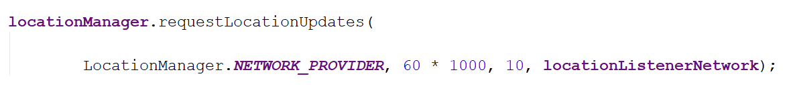

### GetGPSLocation
Get GPS location with network, developed on Android Studio.
I did several tests and find that getting GPS location by internet is better than that by GPS, as GPS does not work sometime. 

### Request location and internet permissions
There are two location permissions, ACCESS_FINE_LOCATION and ACCESS_COARSE_LOCATION.
To request location and internet permissions, add the following to your app manifest\
    \<uses-permission android:name="android.permission.ACCESS_COARSE_LOCATION" />\
    \<uses-permission android:name="android.permission.ACCESS_FINE_LOCATION" />\
    \<uses-permission android:name="android.permission.INTERNET" />
    
### Location updated every one minute and every 10 meters
time: 6*1000 ms\
distance: 10 m

### Result

